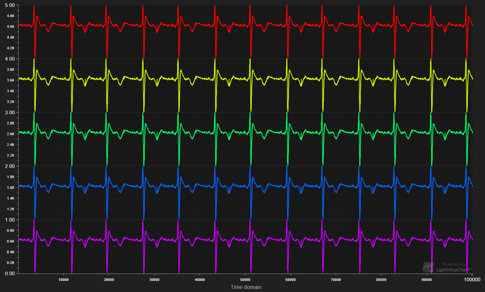

Public comparison of LightningChart® JS performance against other JavaScript charting libraries in visualizing a realtime multichannel ECG chart:


The following chart libraries were tested:
- [LightningChart® JS v3.0.0](https://www.arction.com/lightningchart-js/)
- [Highcharts 9.1.0](https://www.highcharts.com/)
- [SciChart 1.4.1578](https://www.scichart.com/javascript-chart-features/)
- [Anychart 8.9.0](https://www.anychart.com/)
- [amCharts 4](https://www.amcharts.com/)
- [ECharts 5](http://echarts.apache.org/en/index.html)
- [DvxCharts 5.0.0.0](https://www.dvxcharts.com/)
- [Dygraphs 2.1.0](https://dygraphs.com/)
- [Canvas.js 3.2.16](https://canvasjs.com/)
- [μPlot 1.6.8](https://github.com/leeoniya/uPlot)
- [Plotly.js 1.58.4](https://plotly.com/javascript/)
- [ZingChart 2.9.3](https://www.zingchart.com/)

Competitor results are kept unidentified (for example, "Competitor A").

## Benchmarks

Below you can find an overview of library performance in a streaming application by visualizing *refresh rate* (frames per second).
- Higher bar corresponds to smoother performance.
- Orange bar color means stuttering is visible to human eye.
- Red bar color means stuttering is constant and feels laggy, or even unusable.

### PC

- Date: 05.05.2021
- OS: Windows 10
- Browser: Google Chrome v90.0.4430.93
- CPU: AMD Ryzen 5 2600
- GPU: NVIDIA GeForce GTX 1050 Ti
- RAM: 8 GB

")

Full benchmarks data can be found [here](https://github.com/Arction/javascript-charts-performance-comparison/blob/main/bench/benchmarks_pc.csv).

### Laptop

- Date: 05.05.2021
- OS: Windows 10
- Browser: Google Chrome v90.0.4430.93
- CPU: Intel Core i7-8550U CPU 1,80 GHz
- GPU: Intel UHD Graphics 620
- RAM: 8 GB

")

Full benchmarks data can be found [here](https://github.com/Arction/javascript-charts-performance-comparison/blob/main/bench/benchmarks_laptop.csv).

### High end PC

- Date: 05.05.2021
- OS: Windows 10
- Browser: Google Chrome v90.0.4430.93
- CPU: Ryzen 9 5900X
- GPU: RTX 3080
- RAM: 32 GB

")

Full benchmarks data can be found [here](https://github.com/Arction/javascript-charts-performance-comparison/blob/main/bench/benchmarks_high-end-pc.csv).

## Results analysis

All of the included chart libraries proved to be capable of visualizing the realtime multichannel ECG chart.
Increasing the amount of channels and data streaming rate eventually leads to FPS dropping and more and more time spent in updating the chart.
When FPS drops below ~30...40, the stuttering becomes visible to user and the web page becomes uninteractive.

Most chart libraries were able to handle 1 ECG channel with a total of 1000 data points streamed in every second, and a 1 second time domain view.
After this threshold, most libraries performance plummets, except for LightningChart® JS, Competitor A and Competitor E.

Soon after, at 10 ECG channels with a total of 100 000 data points streamed in every second, and a total of 10 million data points visible on screen, LightningChart® JS was the only chart library that could still function with excellent FPS, and going even further to **total of 10 million data points streamed in every second** (on high end PC).

LightningChart® JS was able smoothly visualize, with over 40 FPS, data rates that are **90 x more than average of the competitors** in this test. 

## Errors in data visualization

Chart library performance is important, but producing correct visualizations is even more important. This section contains some cases where **incorrect** or *unexpected* results were identified.

### Downsampling

Some chart libraries are known to utilize internal downsampling of input data.
While this yields increased performance, it produces incorrect visualization which is unacceptable in any realistic application.

The following competitors have been tested and proven to utilize downsampling:

- Competitor C

")

Same data visualized *correctly* with LightningChart® JS:


### Other errors

With extremely dense data (100 μs resolution), competitor G produces incorrect visualization (curve looks like it is thicker than it should, or like there is a lot of *noise*). In this case, the Y value can't be accurately identified. Additionally, the visualized Y min/max range is out of the input data bounds (max Y is obviously drawn higher than 5.0).


Same data visualized *correctly* with LightningChart® JS:




## Replicating performance benchmarks

The benchmark applications and all related resources can be found in `bench/` folder.

**Hosting development server**

```
npm i --global http-server

http-server
```

Afterwards, benchmark index page can be found in `localhost:8080/bench` by typing the URL directly into a browser (like Google Chrome).

The test parameters are configured by modifying `bench/config.iife.js`. After modifications, a *cache refresh* is usually required (reload page with Shift+Ctrl+R).

All the benchmark applications run for specified amount of time (30 seconds by default), and then print out the benchmark results into the *console*.

### Required dependencies

Some chart libraries do not have public URLs where the latest version can be fetched. For these libraries, you have to manually download their library build, and place it in the `bench` folder in order for the application to work.

- LightningChart® JS | Included in project `lcjs.iife.js`
- μPlot | Requires `uPlot.iife.min.js`, `uPlot.min.css`
- DvxCharts | Requires `dvxCharts.chart.min.js`, `dvxCharts.chart.min.css`, `dvxCharts.styles.css`

### Chart libraries that require a license

*SciChart* can't be run with the above method, as there is no IIFE build available, and it also requires licensing management software installed on the local computer. *SciChart* benchmark application can be found in `bench/scichart/`.
