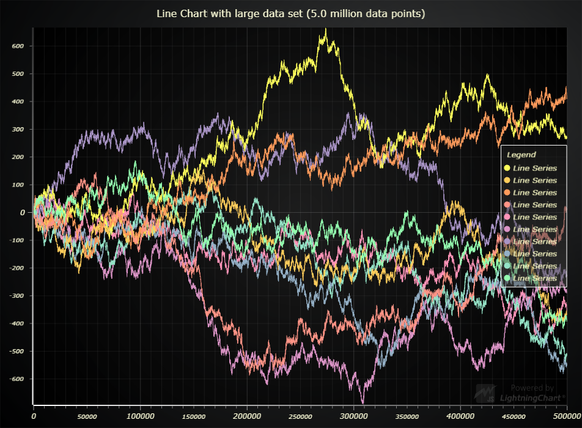
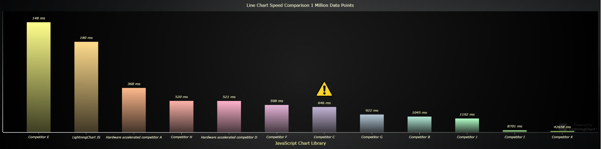
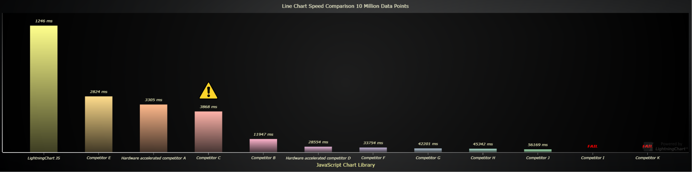
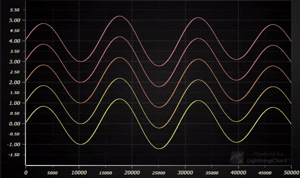

Public comparison of LightningChart® JS performance against other JavaScript charting libraries in visualizing line charts:

Line charts are perhaps the most commonly used chart type in all fields of data visualization.
For testing their performance in different types of applications, we have identified 3 different application types of line charts:

1. **Static line chart**. An XY or Y data set is loaded and displayed as line chart.

2. **Refreshing line chart**. In this case, the data is dynamic changing every so often (_refresh rate_). Used in real-time monitoring / analysis.

TODO: Video

3. **Appending surface chart**. Also dynamic data, but in this case the previous data is not cleared, instead just shifted out as new data is pushed in. Used in several fields with different real-time data sources.

TODO: Video

This repository contains performance tests for these 3 application types.

The following chart libraries were tested:
- [LightningChart® JS v.3.3](https://www.arction.com/lightningchart-js/)
- [Highcharts 9.1.0](https://www.highcharts.com/)
- [SciChart JS v.2.0.2115](https://www.scichart.com/javascript-chart-features/)
- [Anychart 8.9.0](https://www.anychart.com/)
- [amCharts 4](https://www.amcharts.com/)
- [ECharts 5](http://echarts.apache.org/en/index.html)
- [DvxCharts 5.0.0.0](https://www.dvxcharts.com/)
- [Dygraphs 2.1.0](https://dygraphs.com/)
- [Canvas.js 3.2.16](https://canvasjs.com/)
- [μPlot 1.6.17](https://github.com/leeoniya/uPlot)
- [Plotly.js 1.58.4](https://plotly.com/javascript/)
- [ZingChart 2.9.3](https://www.zingchart.com/)

Competitor results are kept unidentified (for example, "Competitor A").

## Benchmarks

All applications that were created to test performance are included in this repository, open-source (`bench/` folder).
See [Replicating performance benchmarks](#replicating-performance-benchmarks) section to learn more about replicating the results.

The later referenced benchmarks can be found in `bench/benchmarks`. These were measured on 25.11.2021, with an average office PC (Intel Core i7-7700K, 16 GB RAM, AMD Radeon R9 380).

## Static performance comparison breakdown

We have a selected two tests from the set of static performance tests to highlight the performance differences between charts most effectively.

### Small data set size

The word "small" can be misleading, but the nature of this test is to test charts performance when the data set size is not big enough to be downloaded into run-time memory.
In practice, this is usually around the range of 10 million data points, however, we'll highlight the test with 10 channels and each channel receiving 100 thousand data points.

| JavaScript Chart Library | Loading speed * |
|:---|:---|
| Competitor E | 148 ms |
| **LightningChart JS** | **180 ms** |
| Hardware accelerated competitor A | 368 ms |
| Competitor H | 520 ms |
| Hardware accelerated competitor D | 521 ms |
| Competitor F | 598 ms |
| Competitor C | 646 ms ** |
| Competitor G | 922 ms |
| Competitor B | 1045 ms |
| Competitor J | 1192 ms |
| Competitor I | 8701 ms |
| Competitor K | 42658 ms |

\* Average of measurements with Google Chrome and Mozilla Firefox browsers.

\** Chart library uses [down-sampling](#downsampling), the performance reading is invalid.

This is a good place to explain what does the **"loading speed"** measurement include. You might run into various claims of JavaScript loading speed in the internet, but we believe that there is only one correct way to measure this.

> Loading speed is the time (seconds) which user has to wait for their chart to be visible on the web page.

Some inconsistencies to this statement which you might have to look out for:

- Setting up rendering frameworks and licenses, or any other steps which users have to do are included in loading time.
- Loading speed includes any chart processing time between initiating the chart creation and displaying it.
- In addition to this, loading speed **also includes any extra time that is required before the chart is visible**.

From the bar chart above, we can see that LightningChart JS is the second fastest JavaScript chart in visualizing 1 million data points.
Well done, competitor E!

Regardless, we still consider LightningChart JS to be easily the fastest chart in line chart visualization, as setting up WebGL takes a bit more time initially than lighter web drawing frameworks. We'll prove this in the next test case.

### Large data set size

When visualizing large data sets in web frontend, you have to load your data in size-limited parts in order to avoid crashing due to using too much memory.
In the following test, 10 channels receive a total of 1 million data points each, 100 thousand points at a time. The goal of the test is to measure how fast the chart library can produce the final data visualization without allocating all of the data set into memory at a single time and risking an application crash.

| JavaScript Chart Library | Loading speed * |
|:---|:---|
| **LightningChart JS** | **1246 ms** |
| Competitor E | 2824 ms |
| Hardware accelerated competitor A | 3305 ms |
| Competitor C | 3868 ms ** |
| Competitor B | 11947 ms |
| Hardware accelerated competitor D | 28554 ms |
| Competitor F | 33754 ms |
| Competitor G | 42201 ms |
| Competitor H | 45342 ms |
| Competitor J | 56169 ms |
| Competitor I | Fail |
| Competitor K | Fail |

\* Average of measurements with Google Chrome and Mozilla Firefox browsers.

\** Chart library uses [down-sampling](#downsampling), the performance reading is invalid.

As we can see from the bar chart above, with heavier applications the power of LightningChart JS starts to show even in static data visualization applications, being ready **25.7x faster** than the average non hardware accelerated chart and **12.8x faster** than the average hardware accelerated chart.

TODO >>>> Refreshing

TODO >>>> Appending

TODO >>>> Update below section

## LightningChart JS Line Chart Capabilities

As you might know, LightningChart JS utilizes hardware acceleration for its graphics. This results in three very particular performance properties:
- **Low CPU usage**
    - As you can see from both highlighted real-time performance scenarios, LightningChart JS is extremely efficient on CPU usage with stark contrast to other chart libraries.
- **High refresh rate**
    - In all highlighted real-time performance scenarios, LightningChart JS refreshes with the maximum required display rate.
- **Hardware scaling**
    - Perhaps something which is not talked about enough; hardware acceleration enables utilizing the power of device graphics processing units (GPU). As a result of this, LightningChart JS performance skyrockets when powerful hardware is used.

It is worth noting, that this is not as simple as "if something is hardware accelerated then it must perform well". There are large differences even between performance of hardware accelerated web charts.

**Let's see what happens when LightningChart JS is used with a powerful machine ...**

We performed a separate test iteration with a more powerful PC (Ryzen 9 5900X, 64GB RAM, RTX 3080) to see what is the maximum capability of LightningChart JS Surface charts. Here's the results!

### Static surface chart

- Maximum data set size: **2 BILLION data points** (45000x45000)
- Massive 10000x10000 surface grid can be loaded in less than a second! (768 ms)
    - This translates to processing ~130 million data points in 1 second.

### Refreshing surface chart

- **LightningChart JS officially enables real-time refreshing surface data visualization**. From the performance results of older data visualization tools, it can be seen that they are simply not efficient enough with CPU usage to allow this kind of applications. Here is one performance test result we'd like to highlight:

| JavaScript chart library | Refresh rate (Hz) | Surface grid dimensions | Total data points per refresh | Achieved refresh rate (FPS) | CPU usage (%) |
|:---|:----|:----|:----|:----|:---|
| LightningChart JS | 60 | 1000x1000 | 1 million | **60.0** | **16.0%** | 

In this test, a surface data set is refreshed 60 times per second. This is the most common maximum refresh rate of computer monitors, thus a very commonly used refresh rate in monitoring solutions.

Note, the CPU usage from LightningChart JS: **16.0 %**. This leaves plenty of power for the rest of the web page as well as something often forgotten before it is a problem: transferring the data to the data visualization application, as well as possible data analysis computations.

### Appending surface chart

- **LightningChart JS officially enables real-time appending surface data visualization**. From the performance results of older data visualization tools, it can be seen that they are simply not efficient enough with CPU usage to allow this kind of applications. 

**Why is this?**

Most importantly, this is due to design decisions. All other chart solutions that we tested only allowed following actions:
- Create surface chart with X data set.
- Update existing surface chart with X data set.

However, this is not applicable to appending surface charts because of several reasons:

1. User is responsible for appending data and shifting old data out.
    - This means that actually users are implementing a significant part of the data processing.

2. Data update is not optimized.
    - Even if only one sample is added to the surface, it results in the entire chart being updated as if the whole data set was changed.
    - This will NEVER perform on an acceptable level in real-time applications.

**How does LightningChart resolve this issue?**

From the start, LightningChart JS was designed to work in all real-time applications. For this reason, we have a dedicated surface chart feature, which handles all the above mentioned processes internally, while user only has to push in new samples to append.

...and here is how it performs with a fast machine:

| JavaScript chart library | Surface grid dimensions | New data points per second | Achieved refresh rate (FPS) | CPU usage (%) |
|:---|:----|:----|:----|:----|
| LightningChart JS | 2000x1000 | 200 thousand | **55.0** | **2.5%** | 

This is an extremely heavy application, with each sample having 2000 data values and displaying time domain history from 10 seconds with 100 new samples added per second.

In practice, this should cover any realistic need for 3D spectrogram data visualization applications, which are usually limited by sample size and refresh rate.

## End word

Read more about Lightning Chart JS performance why and how at our [web site](https://www.arction.com/high-performance-javascript-charts/).

To interact with LightningChart JS Surface charts, please continue in our [Surface chart examples gallery](https://www.arction.com/lightningchart-js-interactive-examples/search.html?t=surface).

## Replicating performance benchmarks

The benchmark applications and all related resources can be found in `bench/` folder.

Please see [bench/README.md](bench/README.md) for development instructions.
