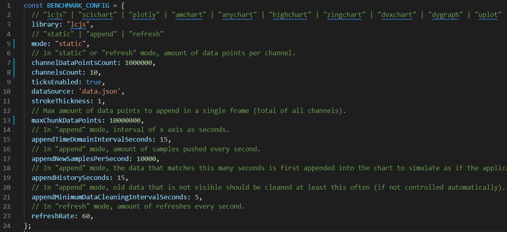

For running performance tests, `Node.js` and `Visual Studio Code` (light-weight IDE) are recommended.

Start benchmark app with

```
cd bench
npm i
npm start
```

Modify active benchmark by directly editing `bench/config.js` file.



## Reading benchmark measurements

- `"fail"` | If application doesn't display at all or displays incorrectly or performs with absolutely terribly `true`, otherwise `false`.
- `"loadupDelayMsChrome"` | Read from console when running with Google Chrome browser.
- `"loadupDelayMsFirefox"` | Read from console when running with Mozilla Firefox browser.
- `"cpuChrome"` | Read CPU usage as % from browser developer tools when running with Google Chrome browser.
- `"fpsChrome"` | Read from console after application has been running for at least 15 seconds, while running Google Chrome browser.
- `"fpsFirefox"` | Read from console after application has been running for at least 15 seconds, while running Mozille Firefox browser.
