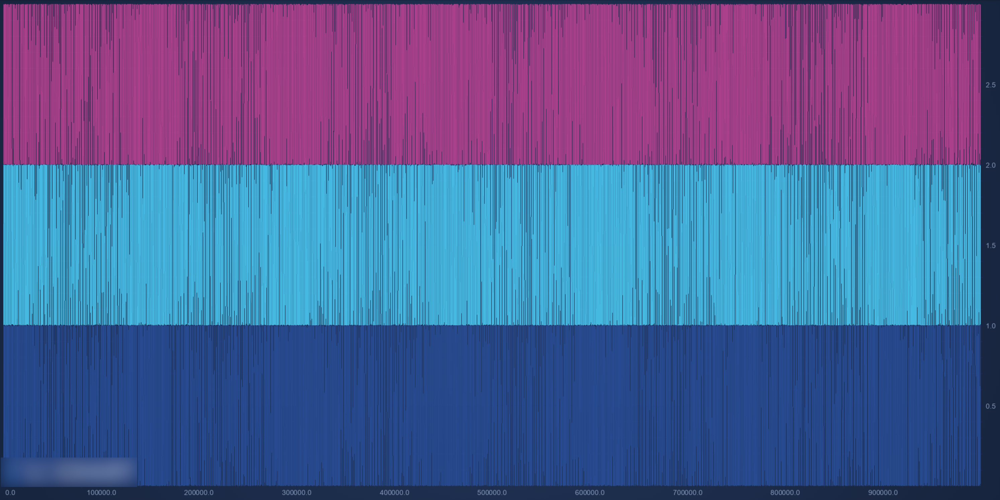
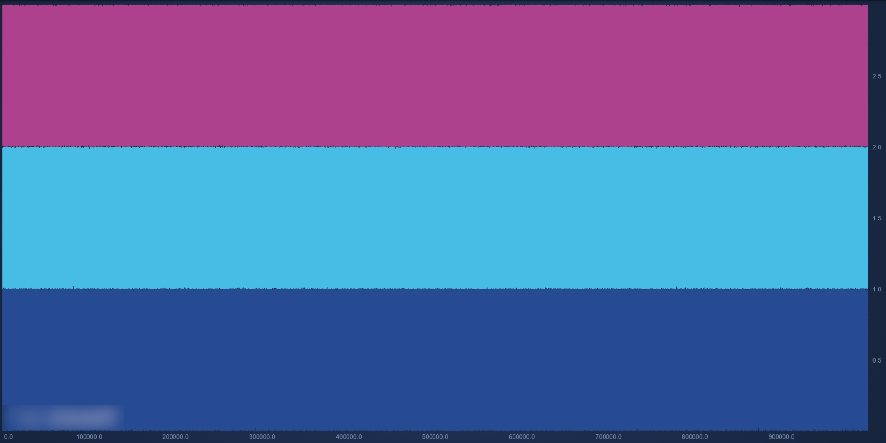
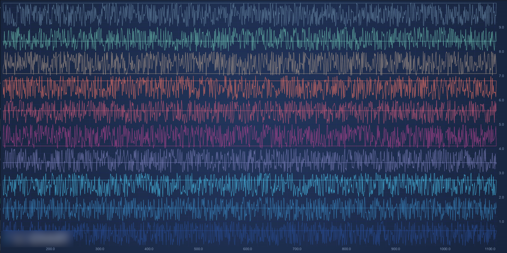
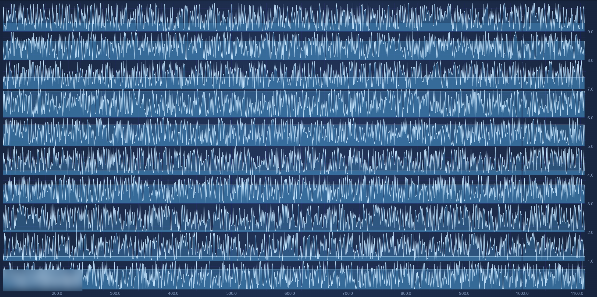
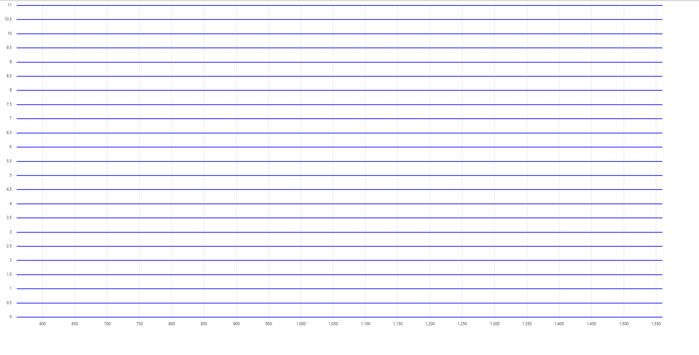
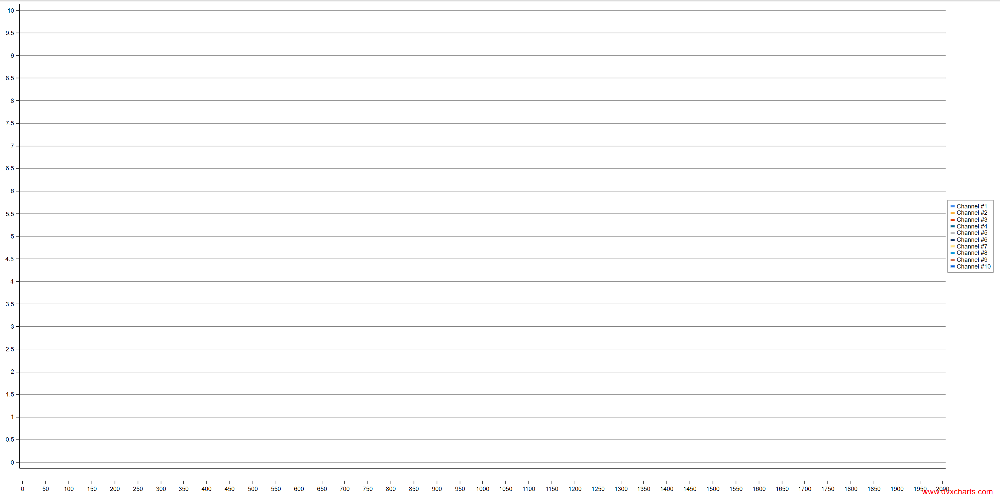
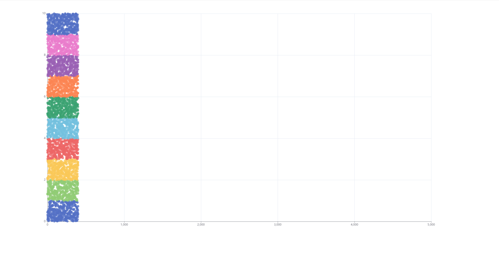

## Competitor D enableResampling

`enableResampling` has to be set to `false` as its been identified to result in malformation of data visualization.

If `enableResampling` is unspecified or set to `true`, a random generated line chart with values ranging from [0, 1] is displayed incorrectly like below:

Setting `enableResampling` to `false` results in the correct visual result:

This data set has 1 million samples and line thickness is configured to 2 pixels. The data is so thick that the expected visual result is a completely filled rectangle.

## Competitor D rendering errors with line/area/step charts

Some strange rendering error visible.
Not considered in anyway for the performance comparison results.

## Competitor T real-time visualization error

Real-time tests bug out after ~5 seconds, resulting in all graphs showing flat lines.
Afterwards, FPS will be recorded to be much better than when the graphs are properly visible.
To workaround this issue, this particular solutions real-time tests are limited to 5 seconds.

## Competitor C scatter visualization error

When trying to visualize more than 1000 scatter points, this solution results in completely empty chart.

## Competitor K scatter visualization error

When trying to visualize more than 5000 scatter points, this library does some strange async data loading animation, and eventually discards 90% of the data.

